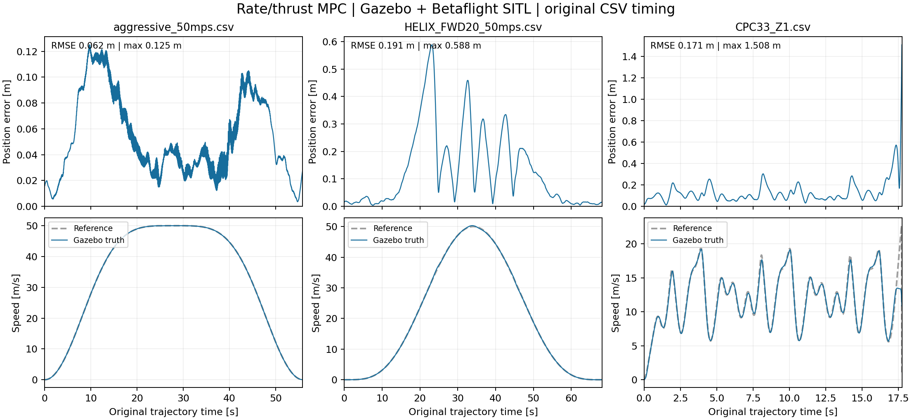

# 总推力／角速度 MPC 改造与验证（2026-09-22）

当前开发机：x86 Linux、ROS 2 Humble。本次未访问实体 UART、刷写飞控或在 CM5 上测试。
硬件配置保留缺失质量/约束的拒绝值及 `shadow_only: true`；软件检查不构成首飞结论。

## 模型与接口

当前控制入口仍为 `flight.launch.py controller:=MPC`，`controller:=GEO` 仍可选择几何控制。
仅使用 `config/simulation.yaml`、`config/hardware.yaml` 两套运行参数。

MPC 改为 10 状态 `x=[p,q,v]`、4 输入 `u=[T/m,ωx,ωy,ωz]`。
优化输入直接对应 Betaflight rates/thrust 命令，首个优化输入直接输出；不再优化四个单电机推力，
不再用下一预测状态的角速度代替当前命令。`Command.thrusts` 保持未知。
预测为理想内环运动学，20×50 ms=1 s，实际控制周期仍为100 Hz。
不读取惯量、力臂、kappa、电机转速/推力多项式/时间常数；质量仍用于总推力边界和输出单位转换。
模型不包含电机、内环、传输延迟或气动阻力；输入边界不保证实际混控分配可行。

| 当前代码 | 作用 |
|---|---|
| [drone_model.py:51](/home/sia/agilicious_internal-main/agilib/externals/acados_code_generator/drone_model.py:51) | 运动方程、参考四元数与代价残差 |
| [drone_model.py:79](/home/sia/agilicious_internal-main/agilib/externals/acados_code_generator/drone_model.py:79) | 输入边界、20段时域、SQP-RTI生成配置 |
| [mpc_params.cpp:15](/home/sia/agilicious_internal-main/agilib/src/controller/mpc/mpc_params.cpp:15) | 新权重读取；明确拒绝旧单电机 R、Q_omega/CoG 参数 |
| [pilot_params.cpp:136](/home/sia/agilicious_internal-main/agilib/src/pilot/pilot_params.cpp:136) | External外环允许MPC/GEO共用最小机体模型 |
| [controller_mpc.cpp:17](/home/sia/agilicious_internal-main/agilib/src/controller/mpc/controller_mpc.cpp:17) | 参考组装、求解、有限值/边界检查、rates/thrust输出 |
| [controller_mpc.cpp:117](/home/sia/agilicious_internal-main/agilib/src/controller/mpc/controller_mpc.cpp:117) | 重置真实求解器迭代；失败后后续预热重建缓存 |
| [controller_mpc.cpp:143](/home/sia/agilicious_internal-main/agilib/src/controller/mpc/controller_mpc.cpp:143) | 总推力限制除以质量，角速度限制直接作用于输入 |
| [wrapper.cpp:78](/home/sia/agilicious_internal-main/agilib/src/controller/mpc/wrapper.cpp:78) | 对齐四元数符号、设置当前状态、执行acados、读取预测 |

生成器先在临时构建目录生成、编译并检查，再复制生成C；运行节点不生成参数文件。
生成依赖、版本警告与复现命令见 [生成器说明](../agilib/externals/acados_code_generator/README.md)。

默认 `R_collective_thrust=0.1`、`R_body_rates=[50,50,50]`。
旧 R 的单位是单电机N，不能照抄到新输入。通用机体阶跃试验中，初始权重1使三轴同时打满、
混控饱和并发散；权重50在相同电机/刚体/角速度内环模型下收敛，最大倾角约17.7°。
这是数值模型中的调参依据，没有测得真实飞控响应，也没有消除上述模型假设。
测试同时修复旧用例重复添加电机/刚体模型的问题，并按实际100 Hz运行；未放宽末端误差门限。

## 三条轨迹与判定方法

按用户要求统一短表头。aggressive、CPC各只修改第一行；HELIX原本就是短表头。
三条文件所有数值行逐字节保持不变，仍为30列数据，包含加速度和四路源机体推力。
没有缩放时间、速度、翻转或裁掉难飞片段。加载器先估计源机体质量，将其总推力换成质量归一化前馈。

| CSV | 点数 | 时长 s | 最大参考速度 m/s | 最大参考倾角 | 特征 |
|---|---:|---:|---:|---:|---|
| aggressive_50mps | 750 | 55.871 | 50.000 | 74.7° | 高速非倒飞 |
| HELIX_FWD20_50mps | 24001 | 68.219 | 50.000 | 180.0° | 含倒飞，相对起点升高约147 m |
| CPC33_Z1 | 801 | 17.750 | 22.924 | 109.0° | 含翻转，最大单轴角速度约15 rad/s |

CPC源推力与 `m*|a-g|` 的拟合残差RMS约1.63 N，显著高于另外两条，原始前馈并不完全一致。
保留这一数据特征，不为降低跟踪误差改写数据。

验证分两层：

1. **数值回放**：每10 ms把原轨迹状态输入MPC，并采完整预测参考。检查整个时段求解成功、输出格式和约束。
   这是给定真实参考状态的求解器回归，不是闭环跟踪，也不包含ROS、估计器或串口开销。
2. **物理闭环**：Gazebo→传感器适配器→融合→MPC→UDP RC→Betaflight→电机／刚体。
   接收机模拟先ARM低6 s，低油门预解锁2 s，再升到3 m并稳定1 s，最后给一次AUTO上升沿。
   接管后只按原始CSV时钟执行，结束后保持1 s再KILL；无故障自动重接管。
   位置误差以同时间戳的Gazebo真值为准，另存融合误差，不事后平移或拟合时间偏移。
   判定要求全程完成、采样/参考/评分覆盖率均≥99%、有效控制最大间隔≤25 ms、真值位置RMSE≤1 m、KILL后输出关闭。

启动等待和解锁等待只用于模拟器准备，不改变8 ms计算预算、10 ms状态年龄、25 ms命令期限等保护。

## 已完成的软件检查

| 检查 | 结果 |
|---|---|
| acados模型方程与生成C | 通过：悬停、yaw角速度、倾斜推力、连续5次生成求解器悬停 |
| 核心和ROS2 Release构建、安装 | 通过；沿用现有构建树重新配置和编译，不声称干净colcon构建 |
| 针对性核心GTest | 44项通过，含三条CSV回放、动力学阶跃、最小模型、约束、失效清空、GEO与参考生命周期 |
| 硬件控制／MSP单测程序 | `hardware_pilot_test`、`betaflight_hw_test`通过 |
| Python配置与launch | 16项通过 |
| 实际ROS核心进程 | 3项通过，覆盖MPC/GEO最小模型、控制器只读选择与KILL |
| 双PTY六节点 | 7项通过，MPC/GEO都从最小硬件配置加载；shadow不发MSP200，错误回读／导航／通信故障撤权 |
| 轨迹验证脚本纯测试 | 10项通过 |

最终数值回放（本机、控制器计算时间，不是CM5完整周期）：

| CSV | 求解次数 | 失败 | p99 ms | 最大 ms |
|---|---:|---:|---:|---:|
| aggressive_50mps | 5588 | 0 | 0.145 | 0.169 |
| HELIX_FWD20_50mps | 6822 | 0 | 0.131 | 0.143 |
| CPC33_Z1 | 1776 | 0 | 0.243 | 0.790 |

## Gazebo＋Betaflight SITL 闭环结果

三条均完成原始全程和末端保持，期间没有撤权、输出故障或8 ms预算超限，KILL后输出关闭。
判定均满足上述 **RMSE≤1 m** 标准；此标准不是逐点误差≤1 m。

| CSV | 真值位置RMSE m | 峰值位置误差 m | 参考／实际峰值速度 m/s | 参考时间覆盖率 | 本机计算周期最大 ms |
|---|---:|---:|---:|---:|---:|
| aggressive_50mps | 0.062 | 0.125 | 50.00／50.01 | 99.9958% | 0.574 |
| HELIX_FWD20_50mps | 0.191 | 0.588 | 50.00／50.29 | 99.9995% | 1.301 |
| CPC33_Z1 | 0.171 | **1.508** | 22.92／19.24 | 99.9944% | 0.590 |

参考发布与真值评分覆盖率均为100%；有效控制最大间隔分别11、11、10 ms。
`cycle_seconds`是控制tick入口至发布前的耗时，不包含DDS传输、输出映射／飞控执行，也不是CM5测量。
CPC峰值误差大于1 m，最高实际速度低于参考峰值，不能用较小的整段RMSE掩盖这两点。

CPC的1.508 m峰值发生在17.749 s。原CSV最后22.2 ms内速度从22.924 m/s骤变为零，
位置却继续移动0.515 m；最后一行加速度和推力也归零，和悬停重力补偿不一致。
按速度列完成这次停止需要约1033 m/s²的平均减速度。末端参考不连续与峰值重合，不能据相关性证明它是唯一误差来源。
前17 s的真值位置RMSE为0.129 m、最大0.314 m；全程误差超过1 m约0.05 s，末端保持阶段随后收敛。
没有删除这一末行或修改数值来改善评分。后续用于实机前，应先修复轨迹末端的p/v/a/姿态/推力连续性并重新验证。
上表参考峰值来自原CSV；实际100 Hz插值发布的CPC参考峰值为22.696 m/s，仍高于实测19.235 m/s。



[完整闭环结果JSON](test/results/rate_mpc_20260922/sitl_summary.json)、
[软件检查与数值行校验](test/results/rate_mpc_20260922/verification.json)、
[GTest记录](test/results/rate_mpc_20260922/core_tests.xml)。
完整原始topic CSV、逐帧评分和进程日志位于 `/tmp/agi_rate_mpc_sitl_v3/` 各轨迹子目录（约56 MB）。
这些是本机保存路径，换机或清理 `/tmp` 前需自行归档。

**评分时间语义修正。** `TimeSampler`在融合状态的`state.t`采样参考，而`ComputationStatus.header`记录控制时刻。
首次评分按两个时间戳完全相等关联，只匹配了少量帧，判为覆盖不足。
修正后使用消息已有的 `expected_reference_stamp = computation.stamp - state_age`，再检查最多1 μs的数值舍入误差；
本次三条关联残差实际都为0 ns。真值仍在参考的原始时间戳插值，没有为减小误差平移数据或拟合延迟。
本表由保存的完整原始记录离线重评分得到，原结果保留为 `result.before_rescore.json`；未改写原始消息记录。

**准备阶段的失败尝试。** 首次脚本在抬油门时解锁，随后一次又早于Betaflight的5秒BOOTGRACE，
均被固件保护拒绝，未进入CSV跟踪。第一版日志写入还遇到ROS `numpy.uint16`序列化错误。
脚本已修复为既有SITL规程的ARM低6秒、低油门预解锁2秒，并先保存结论再写原始日志。
这些失败记录保留在 `/tmp/agi_rate_mpc_sitl/`、`/tmp/agi_rate_mpc_sitl_v2/`，没有计入成功闭环结果。
本轮最终三次启动都成功；此前出现过的偶发TCP5761启动超时没有在此得到根因修复。

本结果只验证这套Gazebo机体、Betaflight SITL参数和当前主机。真实推力表、质量、角速度响应／延迟、
GNSS质量及CM5完整闭环时序仍需实测；不能直接据此开展实机高速飞行或宣布首飞准备完成。

## 复现

先按README构建并source ROS与工作区，再执行：

```bash
build/betaflight_sitl/agilib/tests \
  --gtest_filter='MPC.*:OriginalCsv/*:TrajectoryCsv.*:RuntimeConfig.*'
python3 agi_ros2/test/test_sitl_trajectory_harness.py
ROS_LOCALHOST_ONLY=1 ROS_DOMAIN_ID=95 PYTHONUNBUFFERED=1 \
  python3 agi_ros2/test/test_sitl_trajectories.py --output /tmp/rate_mpc_validation
```

可传入一个或多个CSV路径；不传则使用本次三条。脚本显式运行时才启动模拟器，
`--describe-only`只读取数据；`--rescore <已完成运行目录>...`仅离线重评分并保留旧结果。
每次使用独立Gazebo分区，保存启动命令、配置/数据SHA256、
`result.json`、原始topic CSV、`tracking.csv`及各进程日志。所有运行结束后关闭整组进程。

格式检查使用clang-format 23.1.1，维护的MPC代码和新增C++测试完整检查，历史文件检查修改范围；
真实Tab、140列、行末空白及扩展名另行检查。生成C按第三方生成代码处理；没有运行clang-tidy。
