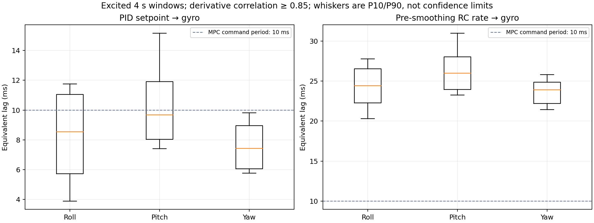
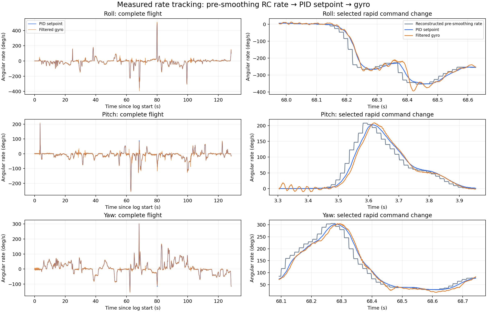

# 手动飞行 Blackbox：角速度响应辨识

源文件：`/home/sia/Downloads/1-测试飞行1(1).csv`。日志头记录 MARK5 DC、
Betaflight 2025.12.2（`79065c96b`），飞行时间为 2026-03-31 03:55:29 UTC。
该提交存在于本地 `/home/sia/betaflight` 的 Git 对象库，字段语义按该提交核对；不是假定当前工作树就是日志固件。
原 CSV 未修改；来源 SHA256、软件版本与全部数值见 [summary.json](summary.json)。
本目录只保存分析产物，没有修改飞控或 MPC 参数。

## 结论

本次飞行的最终 PID 设定值到滤波陀螺反馈，典型动态等效滞后约 5～15 ms。
计入飞控前级 RC 平滑后，已接收的 RC 对应角速度目标到反馈的典型动态等效滞后约 20～30 ms。
这不是 CM5→MSP→飞机→融合的端到端延迟，也不是一个可以直接写入 MPC 的电机时间常数。

| 轴 | PID设定值→反馈中位 ms | 窗口P10～P90 ms | 平滑前RC目标→反馈中位 ms | 窗口P10～P90 ms |
|---|---:|---:|---:|---:|
| Roll | 8.54 | 3.86～11.89 | 24.43 | 20.15～27.79 |
| Pitch | 9.67 | 7.17～15.17 | 26.01 | 23.16～30.99 |
| Yaw | 7.42 | 5.69～9.86 | 23.93 | 21.34～25.84 |

上表采用具有激励且导数相关系数≥0.85的4秒窗口。相关峰是频率相关的等效滞后，窗口有重叠，
P10/P90不是统计置信区间，亚毫秒插值也不代表亚毫秒测量精度。
独立实现得到内环约8.52/8.31/7.56 ms；窗口边界及采样处理使Pitch中位数略有变化，量级结论一致。



## 数据质量与测量对象

- 127357行、80列、128.430862秒；实际平均约992 Hz，采样间隔1.004～1.013 ms，中位1.008 ms。
- `loopIteration`每次增加4；关键时间、目标角速度、陀螺、RC列没有缺失，时间没有重复、倒序或大于2 ms的间断。
- 慢速状态字段有1行缺失；模式位主体为ARM，未启用ANGLE/HORIZON。两个角速度加速度限制均为0。
- `setpoint[0..2]`为最终PID角速度目标，`gyroADC[0..2]`为PID滤波反馈，单位均为deg/s。
- `rcCommands[0..2]`逐行等于`setpoint`；`axisError`逐行等于`setpoint−gyroADC`，不是额外独立测量。
- `gyroUnfilt`是主软件滤波前的角速度，不是无延迟真值。本日志两种gyro之间观察到约2.8～3.0 ms等效差异。
- 误差统计取相对日志开始3～125秒；窗口还要求平均`setpoint[3]>100`及足够角速度激励。
  未声称自动精确识别了离地/着地时刻。

| 轴 | 同时刻PID角速度误差RMS deg/s | 绝对误差P95 deg/s | 最大目标角速度绝对值 deg/s |
|---|---:|---:|---:|
| Roll | 3.42 | 6 | 493 |
| Pitch | 3.39 | 6 | 254 |
| Yaw | 1.94 | 4 | 302 |

这些是手动飞行角速度跟踪误差，不是MPC位置误差。日志缺少MPC位置参考，不能据此声称厘米级轨迹精度。
主体激励集中在低频；独立频谱检查显示所选0.5～30 Hz带内约99%输入能量落在约4～4.5 Hz以下。
它没有充分覆盖目标CSV中的全部快速姿态变化。

## 被直接比较setpoint和gyro遗漏的RC平滑

精确提交`79065c96b`的调用关系：

```text
rcCommand（已去死区的杆量）→ ACTUAL rates → rawSetpoint
→ RC smoothing PT3 → 最终setpoint → PID/FF/混控/机体 → gyroADC
```

历史源码行号（用`git -C /home/sia/betaflight show 79065c96b:路径`读取）：

- `src/main/fc/rc.c:228`：ACTUAL rates；`:656`归一化与映射；`:395`起为PT3平滑路径。
- `src/main/flight/pid.c:1253`：读取设定值；`:1399`保存供Blackbox记录的最终设定值。
- `src/main/blackbox/blackbox.c:1258`：两种gyro；`:1280`起记录RC与setpoint；`:1008`模式掩码。
- `src/main/common/filter.c:35`：PT3截止补偿系数1.961459177。
- `src/main/blackbox/blackbox.c:1771`：尽管参数名含`ff_sp_thr`，实际两个值是setpoint和throttle截止频率。

日志ACTUAL参数为中心70、最大670 deg/s，expo=0、deadband=5。
单数`rcCommand`已经去死区，平滑前角速度可重建为：

```text
r = rcCommand / 495
raw_rate = 70*r + 600*abs(r)*r   [deg/s]
```

记录的角速度PT3截止为15 Hz，油门为25 Hz，RX平滑频率约67 Hz。
前级平滑的动态等效滞后三轴中位均约16 ms，与PT3低频群延迟
`3/(2*pi*15*1.961459177) = 16.23 ms`相符。
该计算不是整个飞机的一阶时间常数。自动截止可能随接收更新率变化，未来MSP 100 Hz不能直接照搬。



右列示例按最大目标变化率选择，刻意展示快速变化，不代表平均工况。

## 留出数据模型比较

在同一飞行中取不重叠4秒块交替训练和验证；每轴只保留有激励的块。
拟合只使用训练块gyro；仿真响应由输入历史生成，不用验证gyro初始化。
输入映射或自动平滑有变化的其他飞行，仍需独立验证。

比较理想瞬时响应、静态增益、纯延迟、一阶、含纯延迟的一阶模型。
下表列理想瞬时响应与含延迟的一阶模型的**验证角速度预测RMSE**，单位deg/s：

| 模型输入 | 轴 | 理想瞬时响应 | 一阶＋延迟 | 解释 |
|---|---|---:|---:|---|
| 最终PID设定值 | Roll | 3.294 | 3.324 | 略变差 |
| 最终PID设定值 | Pitch | 3.406 | 3.380 | 改善很小 |
| 最终PID设定值 | Yaw | 1.721 | 1.604 | 改善约7% |
| 平滑前RC目标 | Roll | 5.362 | 3.343 | 改善约38% |
| 平滑前RC目标 | Pitch | 3.923 | 3.369 | 改善约14% |
| 平滑前RC目标 | Yaw | 2.806 | 1.605 | 改善约43% |

完整候选及拟合参数见 [model_validation.csv](model_validation.csv)。
这支持优先描述RC平滑及完整指令响应，尚不支持“给所有轴随意增加一个内环τ就能提高MPC精度”。
拟合网格为2 ms，部分内环τ小于网格，τ与纯延迟难以分开辨识；这些值不是可部署的标定结果。
纯一阶模型也不能充分描述前馈引起的频率增益抬升、超调和推力相关饱和。
离线预测RMSE改善，不等于闭环位置误差会改善相同比例。

## 对当前实机目标的判断

- 低速悬停：本日志支持内环跟踪能力较好；没有证据要求必须先建立完整电机/惯量模型。
  仍需用实际MSP路径确认时序、映射及悬停推力，不能把手动飞行表现当作MPC接管验证。
- 轨迹跟踪：建议在预测中考虑经过确认的RC平滑及输入延迟，再评估是否需要额外内环响应状态。
  保留总推力/角速度接口即可，不必仅为此退回四电机推力优化。
- 本日志不含CM5计算、UART/MSP排队、传感器回传或融合时间；完整链路可能比这里更慢。
- 不能将25 ms角速度响应乘以50 m/s，直接断言产生1.25 m位置误差。姿态—加速度—位置的关系需要闭环评估。
- 如果机体、桨、PID、前馈、滤波、RC平滑或输入频率改变，应重新核验响应；不要仅据本次拟合修改实机参数。

## 复现与附件

```bash
OPENBLAS_NUM_THREADS=1 OMP_NUM_THREADS=1 MPLCONFIGDIR=/tmp/agi_blackbox_mpl \
  python3 agi_ros2/analysis/blackbox_rate_response_20260331/analyze.py \
  '/home/sia/Downloads/1-测试飞行1(1).csv'
```

[analyze.py](analyze.py)保存完整计算；[review.ipynb](review.ipynb)为可执行结果查看与复现入口。
[window_lags.csv](window_lags.csv)保留所有候选窗口，包括低相关窗口，避免只呈现筛选后的结果。
[frequency_response.csv](frequency_response.csv)为Welch谱/交叉谱估计，低相干频点不能作为可靠辨识依据。
交叉谱方向使用SciPy约定`conj(FFT(input))*FFT(output)`，与正滞后定义一致。
[SciPy方法说明](https://docs.scipy.org/doc/scipy/reference/generated/scipy.signal.csd.html)

本机SciPy 1.8.0对NumPy 1.26.4发出声明支持范围警告；运行未失败，已对已知延迟做数值方向自检，
并以独立实现复核量级。没有据此声称依赖组合完成全面兼容性验证。
