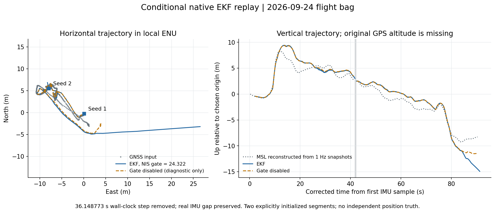
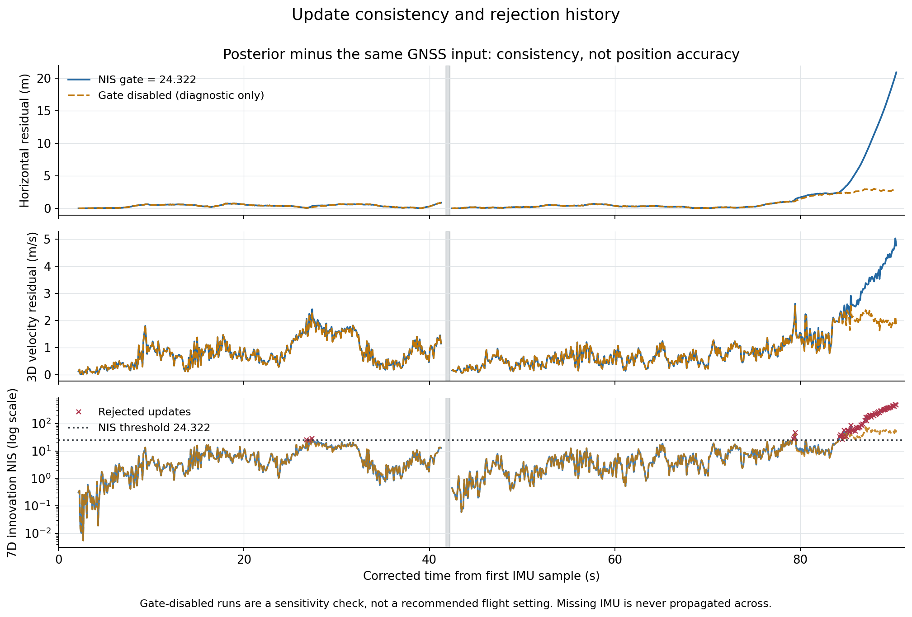

# 飞行 bag 的原生 EKF 离线实验

**已用仓库实际的 `agi::EkfImu` 跑完四种离线方案。前段与 GPS 输入较一致，末段出现连续拒绝更新和明显偏离，
目前不能判定定位正确，也不足以支持 ROS AUTO 悬停。**
这份包中的在线融合始终未初始化；下面是补充明确假设后的离线实验，不能当成原飞行已获得的定位结果。

时钟前跳原因、严重程度、CM5 排查/处理命令及 PID profile 编号解释见
[时钟与 profile 说明](clock_and_profiles.md)。

## 直接查看结果

- [轨迹图 PNG](results/trajectory.png) / [PDF](results/trajectory.pdf)：灰色 GPS 输入、蓝色有门限 EKF、橙色无门限对照。
- [残差与拒绝图 PNG](results/consistency.png) / [PDF](results/consistency.pdf)：偏离主要在末段增大。
- [已执行 notebook](analysis.ipynb)：查看证据、图和可选复算步骤。
- [主方案状态 CSV](results/linear_2s_states.csv)：位置、速度、姿态、偏置，保留全部 GPS 更新及约 50 Hz IMU 预测。
- [主方案更新 CSV](results/linear_2s_updates.csv)：每次 GPS 的接受/拒绝、创新、NIS、输入与后验状态。
- [统计 JSON](results/results.json)、[敏感性对照](results/sensitivity.json)、[独立接口审阅](runner_review.json)。



图的水平坐标为任意局部 ENU 原点下的米，垂直坐标是相对所选 MSL 原点的 Up，**不是离地高度**。
两段分别初始化，缺口处没有插值连接。第二段沿用第一段末端的倾斜姿态/偏置估计，因此两段并不统计独立。

## 数据来源与重建假设

源包为 `bags/hardware_20260924_163013_022677/`。提取时遍历全部 154311 条消息并验证存储 CRC；
使用 45357 条 IMU、883 条有效 GPS/航向及 91 条诊断 MSL 高度快照。
输入与处理记录见 [input_audit.json](inputs/input_audit.json)，运行参数冻结于
[hardware_snapshot.yaml](inputs/hardware_snapshot.yaml)，并保存 SHA-256。

1. **时间**：利用同一次 MSP 请求的墙钟/单调时钟差，扣除已测得的 36.148772983 s 墙钟前跳。
   以首个 IMU 采样时刻为 `t=0`。仍保留 `t=41.795902 → 42.205385 s` 的约 0.409 s 真实 IMU 缺口；
   超过配置的 0.025 s 最大间隔，所以停止第一段，不能用旧 IMU 跨越传播。
2. **位置/高度**：原始导航高度全部 NaN，没有完整 10 Hz GPS 高度。
   将 1 Hz 诊断 MSL 快照近似关联到同会话最近的先前 GPS fix，再分别做线性插值或前值保持。
   不外推，也不跨会话补高度，剩余可用导航观测 867 条。线性插值使用后续样本，只适用于离线分析；
   两种方法均不能恢复真实的全速高度和其原始时间戳。
3. **第一段初态**：使用录包开头 2 s（对照为 1 s）未解锁、低波动 IMU 均值估计 roll/pitch 和陀螺仪偏置，
   加速度偏置设零；初始位置/速度/yaw 取随后首个可用 GPS。
   已记录的整个未解锁 IMU 窗口仅约 2.48 s，短于实机要求的持续 3 s；期间部分 GPS 速度还超过静止要求。
   这是探索性初值，**没有改变实时初始化门限**。
4. **第二段初态**：在 `t=42.360858 s` 显式重设 GPS 位置/速度/yaw，保留第一段末端的倾斜姿态和偏置。
   此时仍在飞行，不能重新估计静止零偏。这个初值有不确定性，不能等价为实机飞行中的自动恢复。
5. **坐标与航向**：使用代码既有的 FLU IMU、ENU 位置/速度/yaw 转换；按操作者确认，飞控已补偿磁偏角，
   ROS 修正为 0。未从本包反推出磁偏角，也未再次补偿。
6. **噪声与门限**：使用配置快照的 `fusion` 参数及导航观测方差：
   `max(hacc, 1 m)²`、`max(vacc, 2 m)²`、`max(sacc, 0.3 m/s)²`、航向标准差 10°。
   主方案的七维 NIS 门限为 24.322，没有针对这次结果调参。上述值是运行假设，不是本包已验证的传感器真误差。

初始化证据及脚本见 [initialization_audit.json](initialization_audit.json) 和
[initialization_audit.py](initialization_audit.py)。

## 主方案结果

主方案 `linear_2s`：2 s 初态、线性重建高度、NIS 门限 24.322。
每段首个 GPS 用于初值，不重复计入下表的更新次数。这里统计的是各 GPS 更新时刻的状态，
不包含最后一个 GPS 后继续传播的 IMU 预测。

| 指标 | 第一段 | 第二段 |
|---|---:|---:|
| 接受 / 尝试 GPS 更新 | 372 / 375 | 413 / 472 |
| 拒绝次数 | 3 | 59 |
| 水平后验与 GPS 输入差，中位数 | 0.420 m | 0.348 m |
| 水平后验与 GPS 输入差，P95 | 0.685 m | 10.506 m |
| 水平后验与 GPS 输入差，最大 | 0.866 m | 20.912 m |
| 垂直后验与重建高度差，最大 | 2.703 m | 6.202 m |
| 三维速度后验与 GPS 输入差，最大 | 2.416 m/s | 5.024 m/s |
| 最大 NIS | 28.621 | 490.142 |

**这些差值不是独立定位精度：同一组 GPS 已经作为滤波输入。**
即使后验紧贴 GPS，也只能说明一致性较好，不能证明飞机真实位置误差只有这些数值。
本包没有 RTK/动捕/测量基准等独立真值，GPS accuracy 和滤波协方差也不能替代真值。



第二段主要拒绝簇在 `t=84.266～90.370 s`，连续 56 次；其余 3 次集中在 `t≈79.3 s`。
持续拒绝开始时距重新初始化约 42 s，不是紧贴时钟跳变发生。
起始位置创新约 `(-1.560, 1.975, 1.850) m`，速度创新约 `(-1.860, 0.078, 1.188) m/s`；
拒绝后失去 GPS 修正，差值继续增大。NIS 是包含相关协方差的七维量，不能仅凭某轴数值大小断言唯一原因。

首尾静止观测还存在一个需要复查的线索：开头 2 s 加速度模长约 9.80 m/s²，
末尾最后 2 s 虽波动较小，均值模长只有约 9.264 m/s²，低于代码重力 9.8066 m/s² 约 0.543 m/s²。
落地前后有扰动，不能把尾段直接当成可靠静止标定；但应在下次独立静止录包中检查加速度校准、比例和偏置稳定性。
测量实际延迟、振动、初值、高度重建、噪声模型也仍是候选因素，本次未确定唯一物理根因。

## 对照实验与接口验证

| 对照 | 相比主方案的结果 |
|---|---|
| 高度改用前值保持 | 两段仍拒绝 3 / 59 次；共同更新时刻水平轨迹最大变化约 0.030 m，垂直最大变化约 0.666 m |
| 初态改用 1 s | 第一段 382/385 接受，第二段仍 413/472；共同更新时刻水平最大变化约 0.136 m |
| 关闭 NIS 门限 | 全部更新接受；第二段最大水平输入差降至 3.016 m，但这只是强制融合后的同源一致性，不能作为实机设置建议 |
| GPS 交付额外延迟 20 ms | 847 次更新的 NIS、协方差、接受/拒绝完全一致；拒绝后状态的数值积分路径差小于 0.2 微米 |

因此，已测的高度插值与短初态选择不足以解释水平末段偏离；回放缓存/交付顺序错误也没有得到证据支持。
这不排除传感器自身测量延迟或更大初值误差，不能通过关闭门限宣称问题解决。

原生 runner 的静止传播、异常 GPS 拒绝/无门限对照、GPS 延迟、IMU 缺口停段及显式重启均已验证。
[unitcases/verification.json](unitcases/verification.json) 保留验证结果，`unitcases/` 保留对应输入/输出/日志。
构建与 C++ 格式检查通过，坐标/字段接口审阅记录在 [runner_review.json](runner_review.json)。
参数未改入实机，未修改 EKF 核心或发送控制命令。

## 复算

在仓库根目录执行，要求已有配置完成的 `build/agi_ros2`，或用 `AGILIB_BUILD_DIR` 指向已有构建目录。
构建细节和 CSV 协议见 [runner_README.md](runner_README.md)。
Python 依赖：`mcap`、`mcap-ros2-support`、`numpy`、`pyyaml`、`matplotlib`，无需启动 ROS 或连接串口。
本次版本分别为 1.5.0 / 0.5.7 / 1.26.4 / 5.4.1 / 3.5.1，Python 3.10。

```bash
analysis_dir=agi_ros2/analysis/hardware_flight_20260924_163013/offline_ekf
bash "$analysis_dir/build_runner.sh"

# 已保存提取输入及参数快照，可直接复跑四种方案并出图：
python3 "$analysis_dir/run_analysis.py"
python3 "$analysis_dir/plot_results.py"
python3 "$analysis_dir/verify_runner.py"
python3 "$analysis_dir/review_runner.py"

# 若需要从原包重提取，固定本次参数快照作为来源：
python3 "$analysis_dir/prepare_inputs.py" \
  bags/hardware_20260924_163013_022677 \
  --output "$analysis_dir/inputs" \
  --profile "$analysis_dir/inputs/hardware_snapshot.yaml"
```

从原包重提取后再运行 `run_analysis.py` 和 `plot_results.py`。要试新配置可显式指定 `--profile`，
另选输入/结果输出目录保存实验，避免混淆本次固定结果。
CSV 的 `covariance_t` 表示最近后验时间；高频预测状态行上的方差不是该预测时刻的传播协方差，
不要直接用这些列画高频准确度置信带。

## 下一份数据应补什么

先完成 CM5 时间同步和部署已修复的配置/版本解析，明确实际使用的 PID profile；
然后记录一份从未解锁静止开始、能够真正 `initialized=true` 的 diagnostic 包。
开头放稳记录约 60 s，保证完整导航高度/基准、GPS 速度/accuracy、航向、IMU、融合状态与诊断都有记录，
并再次核查静止加速度模长。地面移动时用已测量的位置/距离或独立 RTK 参考检查方向和尺度，
记录末尾同样的静止窗口。这样才能区分启动初态、时间戳、传感器标定与滤波模型问题，
并进一步评估定位误差与适用门限。本次不能依据同源残差放宽实机安全门限。
