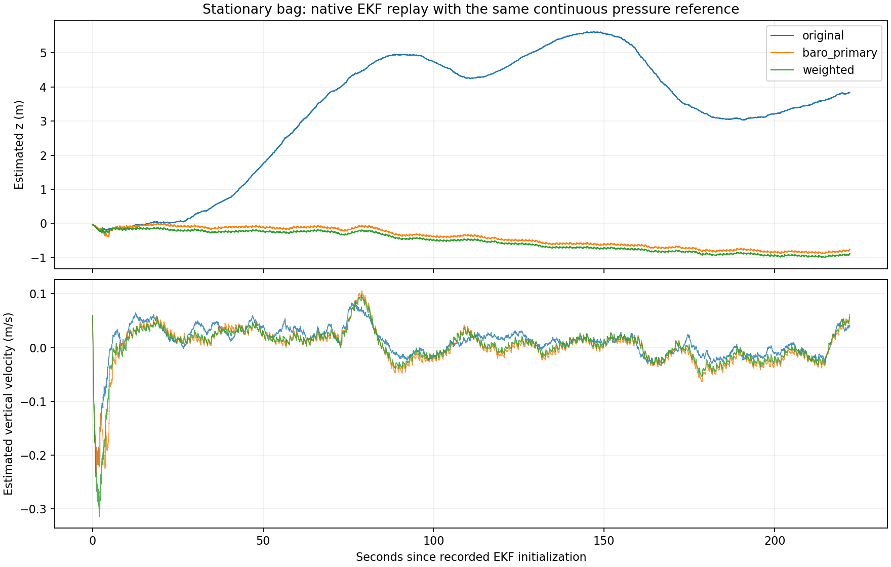

# GNSS 与气压加权融合验证（2026-09-30）

本轮保留 17 维 EKF，硬件配置选择 `baro_gnss_weighted`，并保持 `shadow_only`。
GNSS 的水平位置/速度与航向、高度、垂直速度在同一先验上分别门控，再联合更新。
压力参考对齐后执行 `Kz += Kb; Kb = 0`，用修改后的增益更新均值和 Joseph 协方差。
偏置随机游走为零；参考偏置均值、方差保持，交叉协方差继续更新。
完整配置及恢复语义见 [融合说明](../../../SHADOW_EVALUATION.md#气压高度融合)。

## 原 bag 对照

输入为 `hardware_20260930_171830_188540`。直接使用 MCAP 内嵌消息定义解码，核对存储的 CRC、
全部 topic 计数和 525309 条总记录。准备后的六份 CSV 与前一轮输入的 SHA-256 全部一致。
输入、源码、参考窗口、有效样本数和命令保存在 [comparison.json](comparison.json)。

三个方案采用相同的已初始化状态、IMU/GNSS/压力样本、0.20 s 排序延迟和首次连续压力参考。
原方案源码取自 `6e2394b`，前一轮气压主导方案取自 `bbae240`，新方案使用本次工作树源码；
仅重命名测试副本的类名，避免与共享库中的 EKF 混用。每个方案均编译原生 C++ EKF。

| 指标 | 原三维 GNSS + 自由气压偏置 | 前一轮气压主导 | 新加权方案 |
|---|---:|---:|---:|
| z 最大值减最小值，m | 5.816392 | 0.890842 | **0.958896** |
| 初始化 30 s 后垂速 RMS，m/s | 0.025699 | 0.027578 | **0.025483** |
| X 变化范围，m | 1.717313 | 1.717323 | 1.717320 |
| Y 变化范围，m | 1.926552 | 1.926549 | 1.926550 |
| 30 s 后水平速率 RMS，m/s | 0.017039 | 0.017038 | 0.017038 |
| GNSS 接受 / 拒绝次数 | 2128 / 0 | 2128 / 0 | 水平、高度、垂速各 2128 / 0 |
| 气压接受 / 拒绝次数 | 8698 / 0 | 8698 / 0 | 8698 / 0 |
| 主机回放墙钟耗时，s | 3.66 | 3.55 | 3.49 |

新方案满足预定 **z 范围 ≤ 1.1 m** 和 **垂速 RMS ≤ 前一轮的 110%**；垂速比值为
`0.9240547232`，即降低约 7.6%。相对前一轮，z 范围略增，独立 GNSS 垂速得到保留。
未调整验收标准、气压噪声或就绪门控。静止 bag 没有创新拒绝，异常路径由下面的合成测试覆盖。
每个方案输出 110881 个已初始化时刻，IMU 加入失败、状态查询失败和非有限状态均为零。

另运行原方案并保留记录中的三段参考窗口，回放 z 与记录的最大差为 `0.000093729 m`，
小于 0.1 mm 的复现检查阈值。连续参考比较省略记录中的后续两次重建，不能将其表述为完整 ROS 重放。

新方案最终参考偏置为 0 m，`Pbb=4.189189 m²`，绝对高度 `Pzz=4.186167 m²`，
相对高度 `Pzz+2Pzb+Pbb=0.004176 m²`。后者只描述参考坐标中的不确定性；
原有就绪检查继续使用 `Pzz`。小波动不代表绝对高度精确。



## 复现

从仓库根目录运行；要求已经按项目说明配置 CMake/ROS 构建，且本地 Git 包含两个基线提交。
原始 bag 保持只读，生成的 CSV、源码副本、程序和详细轨迹位于忽略跟踪的 `analysis/` 目录。

```bash
cmake --build build/agi_ros2 -j2
cmake --install build/agi_ros2

# 在分析 Python 环境中安装：mcap mcap-ros2-support numpy pandas PyYAML matplotlib
python3 agi_ros2/test/prepare_height_fusion_replay.py \
  --bag bags/hardware_20260930_171830_188540
python3 agi_ros2/test/replay_height_fusion.py
```

本机 MCAP 依赖位于 `/tmp/mcap-analysis-20260930-baro`，提取时使用
`PYTHONPATH=/tmp/mcap-analysis-20260930-baro python3 ...`。
具体依赖版本、bag/metadata SHA 和输入 SHA 已写入 `comparison.json` 的 `input_manifest`。
`replay_height_fusion.py --skip-build` 会先核对源码、回放 C++ 和共享库 SHA；源变化时必须重新编译。
重放自动检查两个性能阈值、旧记录复现误差和输出有效性，未通过时返回非零退出码。

## 自动验证

- 完整 C++/ROS 构建及安装通过。
- EKF **37/37**：27 项原有回归、10 项新测试。包含显式坐标变换独立对照、偏置/方差保持、
  对称半正定协方差、基准不确定性、三组独立拒绝、全拒绝后的重复时间戳、数值失败回滚、
  同刻压力/GNSS 两种顺序、延迟融合等价、缓慢 GNSS 漂移及真实升降。
- 参考建立 C++ **3/3**：压力方差传播、静止/独立样本要求、间断与无效噪声。
- ROS 融合 **21/21**：旧模式、RTK、新模式、断流/持续拒绝后同参考恢复、空中禁止重建、
  源会话/时钟失效、双垂向恢复要求、连续计数、绝对协方差门控、只读参数及无效启动参数。
- 六节点双伪串口影子测试 **1/1**：真实 MAVLink/MSP 解码、有效压力参考、三组 GNSS 更新、
  控制计算正常；即使模拟 ARM/AUTO 证据，仍无 MSP 200 输出，`override_active=false`。
- 本次高度配置传参专项 **1/1**；完整配置套件为 **21 通过、3 失败**。三个失败也在完整导出的
  未修改 `bbae2401f58f36e60363e0f7f3e3ebd7ecbef145` 基线复现：两个用例仍预期缺推力参数抛错，
  一个仍预期 `thrust_max=0`，当前配置实际为 3.599。本次未修改这部分配置或断言。
- 新增回放 C++ 和节点代码通过 `clang-format --dry-run --Werror`；历史 EKF 文件检查修改范围，
  未批量重排。新增 C++ 使用真实 Tab、140 列限制；C++ 测试/回放严格警告编译通过。
  Python 语法及 `git diff --check` 通过。

测试驱动的两个时序问题已单独处理：跨异步状态/诊断消息的 1 ms 比较改为同一诊断快照；
模拟时钟改为每个毫秒只发布一次，并等待输入 DDS 发现后推进；
授权队列与实际发布节点对齐为可靠 `keep_last(1)`，时钟使用 `best_effort`、深度 1，避免重放过时队列。
探针在旧驱动中记录到授权接收年龄约 0.37 s，超过原有 0.1 s 门限；8 秒内记录 73 次参考阻塞。
最终驱动使用与测试相同的 40 段 `drive(0.2)` 验证，两次未解锁探针均为零次阻塞；
逐样本探针中 191 条授权的最大发布间隔为 0.021 模拟秒，接收年龄最大为 0.0402 s。
证据见 [测试驱动时序摘要](test_driver_timing.json)。授权消息的采集时间、内容、频率和生产门限均未修改。

对应日志随本目录保存。原生 EKF 测试可使用项目测试程序的
`--gtest_filter='EkfImuRtk.*:EkfImuBaro.*:EkfImuNavigation.*'`，或独立编译：

```bash
g++ -std=c++17 -O2 -DNDEBUG -march=native -fno-finite-math-only \
  -DEIGEN_DONT_PARALLELIZE -DEIGEN_STACK_ALLOCATION_LIMIT=1048576 \
  -Iagilib/include -isystem /usr/include/eigen3 \
  -Wall -Wextra -Wpedantic -Werror -Wno-unused-parameter \
  agilib/tests/estimator/ekf/ekf_imu_rtk_test.cpp \
  -Lbuild/agi_ros2/agilib -Wl,-rpath,"$PWD/build/agi_ros2/agilib" \
  -Wl,-rpath-link,"$PWD/agilib/externals/acados-src/lib" \
  -lagilib -lgtest -lgtest_main -pthread -o /tmp/agi-weighted-ekf-test
/tmp/agi-weighted-ekf-test

source /opt/ros/humble/setup.bash
source install/agi_ros2/local_setup.bash
ROS_LOCALHOST_ONLY=1 /usr/bin/python3 agi_ros2/test/test_baro_fusion.py -v
ROS_LOCALHOST_ONLY=1 /usr/bin/python3 agi_ros2/test/test_baro_hardware_pipeline.py -v
ROS_LOCALHOST_ONLY=1 /usr/bin/python3 agi_ros2/test/test_runtime_config.py -v
```

## 适用范围

回放从记录中首个初始化状态种子化；陀螺偏置由记录推得，加速度偏置设零。
压力参考边界由 5 Hz 诊断反推，未重跑 ROS/DDS 调度和实体静止门控。
各方案都预测到最后一个共同 IMU 时刻；末尾 0.20 s 排序窗口中的观测均不提前处理。
静止条件来自操作员描述，没有独立测量的高度真值；这些是静止漂移回归指标。
墙钟耗时包含 CSV 读写，是开发主机上的结果，不是 CM5 实时性能认证。
本轮未实现高速动压补偿，未验证 50 m/s 实机能力；长期失去气压时仍允许逐渐向 GNSS 高度收敛。
