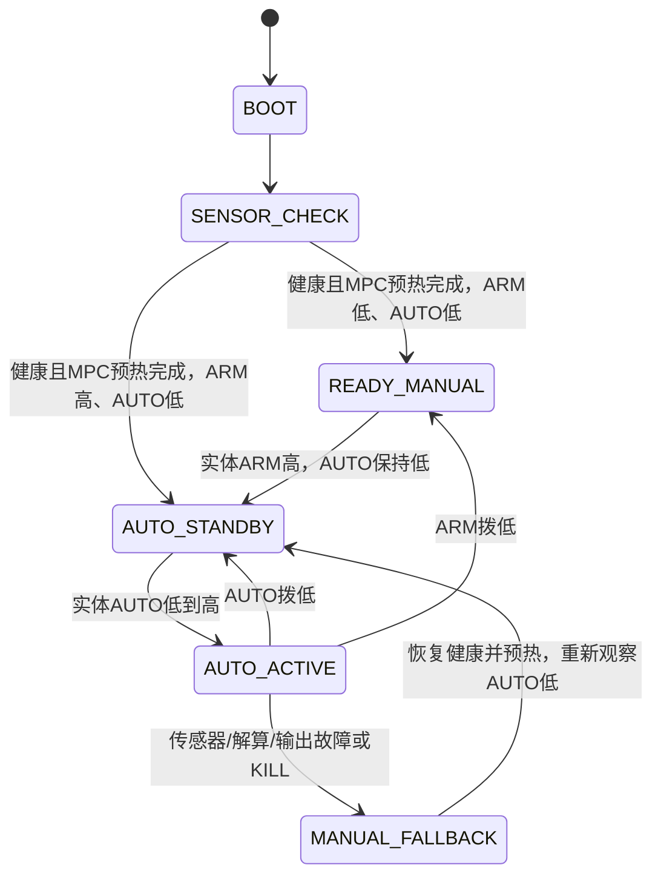

# 状态机、Pilot、MPC 的调用关系

需要状态机，它位于 Pilot 外部，负责决定是否可以把 MPC 输出送往飞控。
`Pilot` 管理估计器接口、参考轨迹、采样器和控制器；`MpcController` 由配置创建，每周期通过 Pilot 的 pipeline 调用。
应用不再单独创建另一份 MPC，也不从两条线程同时调用 Pilot。

本次增加的 `agi::hardware::HardwarePilot` 是可编译、已用真实 acados MPC 测试的运行协调层。
它当前支持**人工悬停后 AUTO 定点接管**，没有自动起飞、自动降落或 CSV 轨迹接口。
传感器驱动、100 Hz 线程调度、MSP 配置解析和串口 mailbox 仍需接入；诊断命令 `--monitor` 不会启动它。

## 状态与动作



启动 AUTO 已经为高时，状态不会进入 ACTIVE；必须在健康且预热完成后观察低位，再拨高。
故障恢复同样如此，传感器恢复不代表恢复授权。

| 状态 | Pilot/MPC | 实机输出 |
|---|---|---|
| BOOT / SENSOR_CHECK | 输入有效时做影子计算；连续50个成功且≤8 ms的周期完成预热 | 停发 |
| READY_MANUAL / AUTO_STANDBY | 继续影子计算 | 停发 |
| AUTO_ACTIVE | 进入时捕获当前位置和yaw，后续保持该参考并持续求解 | 仅允许AETR覆盖 |
| MANUAL_FALLBACK | 输入不健康时停算；健康后重新预热 | 停发，等待人工重新授权 |

这里没有加入 `AUTO_DEGRADED`：当前策略对 RTK/IMU/解算故障直接回退。
没有经过验证的降级估计器时，“先悬停再接管”不能仅靠多加一个状态名称实现。
停发后仍受 FC 固件的 MSP 陈旧窗口限制；急停由实体接收机和 FC 独立完成。

## 每周期实际做什么

`HardwarePilot::tick(fused_state, evidence)` 的调用顺序是：

1. 从统一单调时钟取时间，检查周期是否单调、间隔≤25 ms，融合状态是否新鲜、四元数是否归一化。
2. 检查 IMU/RTK/RC、标定、同步、围栏、MSP 和配置核验等证据。未知证据默认拒绝。
3. 调用 `pilot.odometryCallback(fused_state)`，将**已融合**的 ENU/FLU `QuadState` 交给状态传递接口。
4. 首次计算或 AUTO 上升沿重建 `HoverReference`，固定当前位置与 yaw；不调用 `Pilot::start()`。
5. 调用 `pilot.runPipelineChecked(now)`：`TimeSampler → MpcController::getCommand → 内存 CommandSink`。
6. 只有 pipeline 成功才读取 `pilot.getCommand()`。检查 rates/thrust 格式、时间戳和非负推力。
7. 统计本次协调/求解耗时，更新50周期预热计数，再用**求解完成后的时间**执行 SafetyGate。
8. 返回 `ControlDecision`：本周期命令、更新后的证据、状态名、原因和 `permit_override`。

`solve_seconds` 目前包括状态提交、参考重建、pipeline和取命令，属于整个协调计算阶段的预算；不是纯 acados 核心耗时。
`permit_override=false` 时即使命令数值有效，也只代表影子计算结果，不允许输出。
估计/采样/MPC 失败后可能仍能从旧 Pilot API 读取缓存命令，所以**必须检查新加的 bool 返回值**。

## 为什么不能直接调用 start / enable(true)

- `Pilot::start()` 会按 `takeoff_threshold` 和当前高度选择悬停或生成上升轨迹。它不是“启动MPC线程”。
- `Pilot::enable(true)` 会选择配置的输出桥。若那是旧 MSP/SBUS 桥，权限行为可能不符合实体RC架构。
- `Pilot::launchPipeline()` 会创建内部调度线程，不能再从外部100 Hz线程同时 `runPipeline()`。

协调层因此使用无硬件 I/O 的 `CommandSink`，通过 `enable(false)` 激活这个内存输出。
`off()` 只在内部清参考，不会给实机发 disarm。实际串口只由专门的单线程 owner 管理。

## 应用如何接入

初始化使用已经标定的 Pilot 参数：

```cpp
#include "agilib/pilot/hardware_pilot.hpp"
#include "agilib/bridge/betaflight/betaflight_msp_bridge.hpp"

agi::PilotParams params("pilot.yaml", "/absolute/path/to/hardware_params");
agi::hardware::HardwarePilot control(
    params, agi::hardware::monotonicSeconds);

// 每10 ms，在同一控制线程调用；fused_state和evidence来自真实驱动及监控。
agi::hardware::ControlDecision decision = control.tick(fused_state, evidence);
// 将完整decision放入最新值mailbox，不能只发AUTO_ACTIVE的样本。
```

配置的关键字段如下；`measured_quad.yaml`、`reviewed_mpc.yaml` 必须由实机标定/审核生成，不是仓库现成可飞文件：

```yaml
pipeline:
  estimator:
    type: External
  sampler:
    type: Time
  controller:
    type: MPC
    file: reviewed_mpc.yaml
  inner_controller:
    type: None
  bridge:
    type: External
quadrotor: measured_quad.yaml
dt_min: 0.01
outerloop_divisor: 1
velocity_in_bodyframe: false
guard:
  type: None
```

这段是关键字段说明，不是完整配置模板。其余 Pilot 参数按部署文档建立。
这里的 External estimator 表示真实融合估计器在上游；协调层注册无坐标变换的 Feedthrough 作为传值接口，绝不是用它代替 RTK/IMU 融合。
`guard: None` 指不使用 Agilib 的第二套安全控制pipeline；硬件的围栏证据仍为必需。
构造器在创建 Pilot 前拒绝旧物理桥、MockVIO、机体系速度、非 MPC、软件内环或非100 Hz设置。

串口线程从 mailbox 取最近完整决策，参考处理顺序为：

```text
读取decision（包括手动状态）
 → 若permit_override为false且AUTO为高，将command_valid清为false
 → 若command_valid为true：检查执行包络和新鲜电压，做三轴映射与推力表反解
 → 若映射失败：command_valid=false，并把输出故障送回控制线程
 → 调用bridge.sendOverride(AETR, evidence, 本帧绝对deadline)
 → 若本应发送但失败：通知控制线程调用control.reportOutputFault()
```

当 command 无效时可传 `{1500,1500,1000,1500}` 占位，但必须令 `command_valid=false`，这样接口不会发送该数组。
桥内还保留第二道授权门控，需要观察手动状态中的有效 AUTO 低位；**不能只在 permit_override=true 时调用它**，否则它没有低→高授权历史。
两个门控都必须通过才可能发帧。mailbox 丢失低位事件只会拒绝接管，不会自动获得授权。
无论哪一道门控拒绝，都不发“安全低油门”替代帧。

发送线程只用实时 `CLOCK_MONOTONIC`，不能复用控制线程的冻结时间判断新鲜度。
串口失败通知要经 mailbox 交回控制 owner；不要在串口线程直接调用 `HardwarePilot::reportOutputFault()`。
当前尚未提供这个多线程应用，因此不能把上述接线伪代码当成已部署服务。

## 验证

```bash
cmake -S agilib -B build/betaflight_sitl/agilib \
  -DBUILD_BETAFLIGHT_HW=ON -DFETCH_ACADOS=OFF -DUNSAFE_MATH=OFF
cmake --build build/betaflight_sitl/agilib --target hardware_pilot_test -j 4
ctest --test-dir build/betaflight_sitl/agilib -R hardware_pilot_test --output-on-failure
```

测试使用虚构机体和融合状态，实际运行 Pilot/TimeSampler/acados MPC；不打开串口。
它覆盖启动AUTO高、50周期预热、低高度接管不自动起飞、捕获新悬停点、IMU故障不复用命令、
恢复后重新授权、输出故障、调度暂停，以及 pipeline 的估计器失败返回。
这些是软件集成检查，不是 CM5 实时性或实飞验证。
